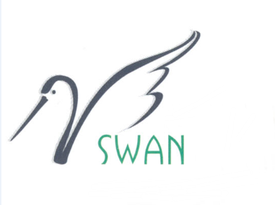

.. Swanphp 框架文档 documentation master file, created by
   sphinx-quickstart on Fri Dec  7 13:54:33 2012.
   You can adapt this file completely to your liking, but it should at least
   contain the root `toctree` directive.

Swanphp 框架文档 
=================================================================

本书的目标是以简明易懂的方式讲解 Redis 的内部运行机制，
通过阅读本书，
你可以了解到 Redis 从数据结构到服务器构造在内的几乎所有知识。

为了保证内容的简洁性，
本书会尽量以高抽象层次的角度来观察 Redis ，
并将代码的细节留给读者自己去考究。

如果读者只是对 Redis 的内部运作机制感兴趣，
但并不想深入代码，
那么只阅读本书就足够了。

另一方面，
对于需要深入研究 Redis 代码的读者，
本书附带了一份 `带有详细注释的 Redis 2.6 源代码 <https://github.com/huangz1990/annotated_redis_source>`_ ，
可以配合本书一并使用。

第一部分：安装部署
-----------------------------------------------------------------

这一部分将对 Swanphp 安装部署进行介绍。

.. toctree::
   :maxdepth: 2

第二部分：模块介绍
-----------------------------------------------------------------

.. toctree::
   :maxdepth: 2

   module/loader

关于
-------------------
